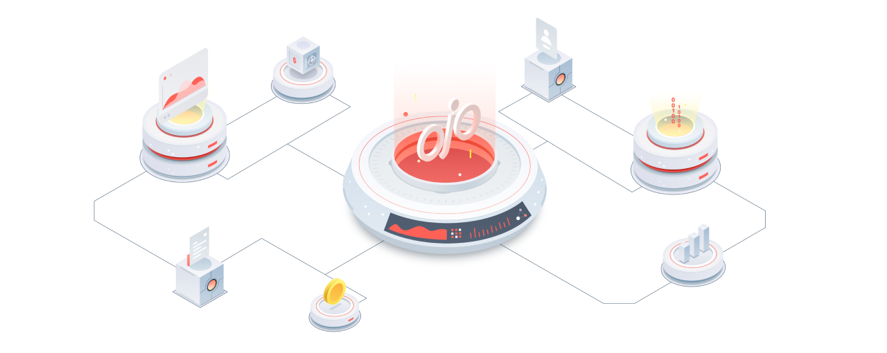

<!-- markdownlint-disable MD041 -->
<!-- markdownlint-disable MD013 -->



[](https://www.repostatus.org/#wip)
[](https://goreportcard.com/report/github.com/ojo-network/ojo)
[](https://github.com/ojo-network/ojo/blob/main/LICENSE)
[](https://github.com/marketplace/actions/super-linter)

> A Golang Implementation of the Ojo Network, a cosmos-first oracle
> with DeFi safety in mind.

Ojo is an oracle platform which other blockchains and smart contracts can use to receive
up-to-date and accurate data. This platform arose from our work at
[Umee](https://github.com/umee-network/umee), where we worked on developing our
own oracle based off of the [Terra Classic](https://github.com/terra-money/classic-core) design.
Now, we specalize bringing the lessons we've learned to the greater Cosmos.

## Table of Contents

- [Table of Contents](#table-of-contents)
- [Releases](#releases)
- [Install](#install)

## Releases

See [Release procedure](contributing.md#release-procedure) for more information about the release model.

Currently, there is no official release of the `ojod` binary.
## Install

To install the `ojod` binary:

```shell
$ make install
```
